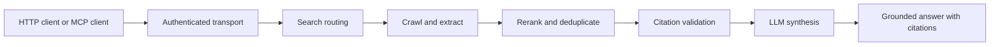

# nexus-agentic-search

[](https://github.com/daniel-volpin/nexus-agentic-search/actions/workflows/ci.yml)
[](LICENSE)
[](https://github.com/daniel-volpin/nexus-agentic-search/releases)

`nexus-agentic-search` is a self-hosted backend for agentic web search.
It gives agents and applications a grounded-search backend with:

- an HTTP API for grounded search and answer generation
- an MCP server for tool-based clients
- a search pipeline that combines web search, crawl, citation validation, and LLM synthesis

The repo is intentionally conservative about security: bearer auth on both transports, SSRF protections on crawl, startup self-tests, secret redaction, and bounded LLM budgets.

This project is aimed at developers who want a grounded-search backend for local experiments, personal tools, or self-hosted assistants. It is not a turnkey hosted search platform.

## Why Try It

- grounded answers with citation validation instead of raw search snippets
- one backend that works both as a direct HTTP service and an MCP tool surface
- self-hosted and inspectable, with explicit security boundaries around crawl and synthesis

## At A Glance

- Best for: local experiments, self-hosted assistants, and developer tooling that needs grounded web answers
- Interfaces: HTTP (`/v1/search`, `/v1/search/stream`) and MCP (`/mcp`)
- Search inputs: SearXNG and optional Brave
- LLM inputs: local LM Studio by default, with Gemini / Vertex / OpenAI fallbacks
- Scope: self-hosted experimentation, not managed hosted search

## Try It In 5 Minutes

Requirements:

- Python 3.11
- `uv`
- one working search path:
  - a reachable SearXNG instance, or
  - a Brave API key
- one working LLM path:
  - local LM Studio models matching [`config/llm.toml`](config/llm.toml), or
  - a Gemini API key, or
  - another provider key after adjusting [`config/llm.toml`](config/llm.toml)

Quick start:

```bash
uv sync --dev
cp .env.example .env.local
```

Set the minimum:

```bash
NEXUS_HTTP_TOKEN=0123456789abcdef0123456789abcdef
NEXUS_MCP_TOKEN=fedcba9876543210fedcba9876543210
SEARXNG_BASE_URL=http://127.0.0.1:8080
GEMINI_API_KEY=your-key-here
```

Run the service:

```bash
set -a
source .env.local
set +a
uv run python -m nexus.main
```

Test it:

```bash
curl -s http://127.0.0.1:8186/v1/search \
  -H "Authorization: Bearer $NEXUS_HTTP_TOKEN" \
  -H "Content-Type: application/json" \
  -d '{
    "query": "What changed in the latest SQLite release?",
    "max_results": 5
  }'
```

Notes:

- The service refuses to start without both bearer tokens.
- For search, you need either a reachable SearXNG endpoint or `BRAVE_API_KEY`.
- The default LLM profile is local-first (`lmstudio/...`) with cloud fallbacks.
- Most unit and security tests run without paid provider access. Golden tests require explicit opt-in plus working external credentials.

## Example Response

```json
{
  "answer_text": "Python is widely used in automation and scripting workflows.[^claim-1]",
  "citations": [
    {
      "url": "https://example.com/python-automation",
      "content_hash": "doc-1",
      "byte_start": 0,
      "byte_end": 56,
      "quote": "Python is a programming language used widely in automation.",
      "claim_id": "claim-1"
    }
  ],
  "rejected_citations": [],
  "documents": [
    {
      "url": "https://example.com/python-automation",
      "content_hash": "doc-1"
    }
  ],
  "cost_usd": 0.2,
  "tokens_in": 100,
  "tokens_out": 25,
  "latency_ms": 1840,
  "degraded": false,
  "ungrounded": false
}
```

## API Contract

HTTP request body:

```json
{
  "query": "How is Python used in automation?",
  "freshness": "any",
  "max_results": 5,
  "lang": "en",
  "country": "us"
}
```

HTTP response fields:

- `answer_text`: synthesized answer text
- `citations`: validated citations included in the answer
- `rejected_citations`: citations the validator rejected
- `documents`: crawled source documents used for synthesis
- `cost_usd`: provider-reported request cost
- `tokens_in`: input token count
- `tokens_out`: output token count
- `latency_ms`: end-to-end request latency
- `degraded`: whether truncation or fallback behavior affected the output
- `ungrounded`: whether the system could not produce a grounded cited answer

MCP tool contract:

- endpoint: `http://127.0.0.1:8185/mcp`
- tool name: `agentic_search`
- input fields: `query`, `freshness`, `max_results`, `lang`, `country`
- output shape: same grounded-answer payload as the HTTP API

## Repository Guide

- Start with [Usage Examples](#usage-examples) if the service is already running.
- Read [Optional Compose Setup](#optional-compose-setup) only if you want the adjacent-container workflow.
- Read [Open Source Notes](#open-source-notes) and [Non-Goals](#non-goals) before planning production use.
- Contributor and maintainer docs: [`CONTRIBUTING.md`](CONTRIBUTING.md), [`SECURITY.md`](SECURITY.md), [`SUPPORT.md`](SUPPORT.md), [`RELEASING.md`](RELEASING.md)

## What "Agentic Search" Means Here

In this repo, agentic search means the system does more than return search results:

1. it searches for candidate sources
2. it fetches and filters selected pages
3. it validates citation spans against retrieved content
4. it synthesizes an answer with grounded citations

The goal is a smart web-search backend that can be used directly over HTTP or as an MCP tool surface for other agents.

## Architecture At A Glance



## Status

- Stable enough to evaluate locally:
  - HTTP and MCP transports
  - search + crawl + citation pipeline
  - security and regression test suites
- Experimental or operator-specific:
  - deployment scripts under `deploy/`
  - advanced infra notes under [`docs/deploy/`](docs/deploy/README.md)
  - model/provider defaults in [`config/llm.toml`](config/llm.toml)

## Usage Examples

HTTP search:

```bash
curl -s http://127.0.0.1:8186/v1/search \
  -H "Authorization: Bearer $NEXUS_HTTP_TOKEN" \
  -H "Content-Type: application/json" \
  -d '{
    "query": "What changed in the latest SQLite release?",
    "max_results": 5
  }'
```

MCP clients:

- connect to `http://127.0.0.1:8185/mcp`
- provide `NEXUS_MCP_TOKEN` as the bearer token
- call the single exposed tool, `agentic_search`

Python MCP example:

```python
import asyncio

from fastmcp import Client


async def main() -> None:
    async with Client("http://127.0.0.1:8185/mcp", auth="YOUR_NEXUS_MCP_TOKEN") as client:
        tools = await client.list_tools()
        print([tool.name for tool in tools])
        result = await client.call_tool(
            "agentic_search",
            {"query": "What changed in the latest SQLite release?", "max_results": 5},
        )
        print(result.structured_content["answer_text"])


asyncio.run(main())
```

## Architecture

Request flow:

1. authenticated HTTP or MCP request enters the service
2. search providers return candidate results
3. crawl fetches selected pages with SSRF and robots controls
4. reranking and deduplication choose grounded sources
5. the LLM synthesizes an answer with validated citations

Key modules:

- [`nexus/search`](nexus/search) for Brave + SearXNG routing
- [`nexus/crawl`](nexus/crawl) for guarded fetching and extraction
- [`nexus/citations`](nexus/citations) for citation validation
- [`nexus/llm`](nexus/llm) for provider routing, budget checks, and redaction
- [`nexus/http`](nexus/http) and [`nexus/mcp`](nexus/mcp) for public transports

## Development Checks

Once the service is configured locally, useful checks are:

```bash
uv run pytest -q
uv run ruff check nexus tests
uv run mypy nexus
```

If you do not run LM Studio locally, provide cloud credentials or edit [`config/llm.toml`](config/llm.toml) to match your provider setup.

## Optional Compose Setup

The compose stack is mainly for operator testing and adjacent-container deployments.
It does not publish host ports by default.
It is not the default host-machine developer workflow.
Examples use `docker compose`, but the stack is conceptually container-runtime agnostic if your environment supports equivalent Compose features.

Use the compose-specific env templates:

```bash
cp secrets/nexus.env.example secrets/nexus.env
cp secrets/searxng.env.example secrets/searxng.env
```

Then fill values and start:

```bash
docker compose up -d --build
```

See [`docs/deploy/README.md`](docs/deploy/README.md) before treating anything under `deploy/` as production-ready.

## Configuration

- [`.env.example`](.env.example): local shell environment example
- [`secrets/nexus.env.example`](secrets/nexus.env.example): compose env file example
- [`config/llm.toml`](config/llm.toml): model/provider routing and token limits

Search defaults:

- SearXNG sidecar for metasearch
- optional Brave API key for a higher-confidence primary provider

LLM defaults:

- LM Studio primary models
- Gemini / Vertex / OpenAI fallbacks, depending on available credentials

## Docs

- [`docs/specs/`](docs/specs): design specs
- [`docs/decisions/`](docs/decisions): architecture decisions
- [`docs/plans/`](docs/plans): historical implementation plans
- [`docs/deploy/`](docs/deploy/README.md): optional deployment patterns and operator notes
- [`docs/oss/`](docs/oss/README.md): reusable open-source launch artifacts and checklists

## Open Source Notes

- No real credentials should be committed; use local env files only.
- `deploy/` contains examples, not a supported universal deployment system.
- The documented public scope is local evaluation and self-hosted experimentation, not turnkey production.

## Non-Goals

- hosted multi-tenant search as a service
- a general-purpose browser automation framework
- a universal production deployment template for every environment

## Contributing

See [`CONTRIBUTING.md`](CONTRIBUTING.md).

Additional community docs:

- [`SECURITY.md`](SECURITY.md)
- [`CODE_OF_CONDUCT.md`](CODE_OF_CONDUCT.md)
- [`SUPPORT.md`](SUPPORT.md)
- [`RELEASING.md`](RELEASING.md)

## Release Readiness

Before publishing a release:

- verify README examples still match the HTTP and MCP surfaces
- confirm `pyproject.toml` URLs and package metadata are current
- confirm no local env files, secrets, or machine-specific paths are staged
- update [`CHANGELOG.md`](CHANGELOG.md) for user-visible changes
